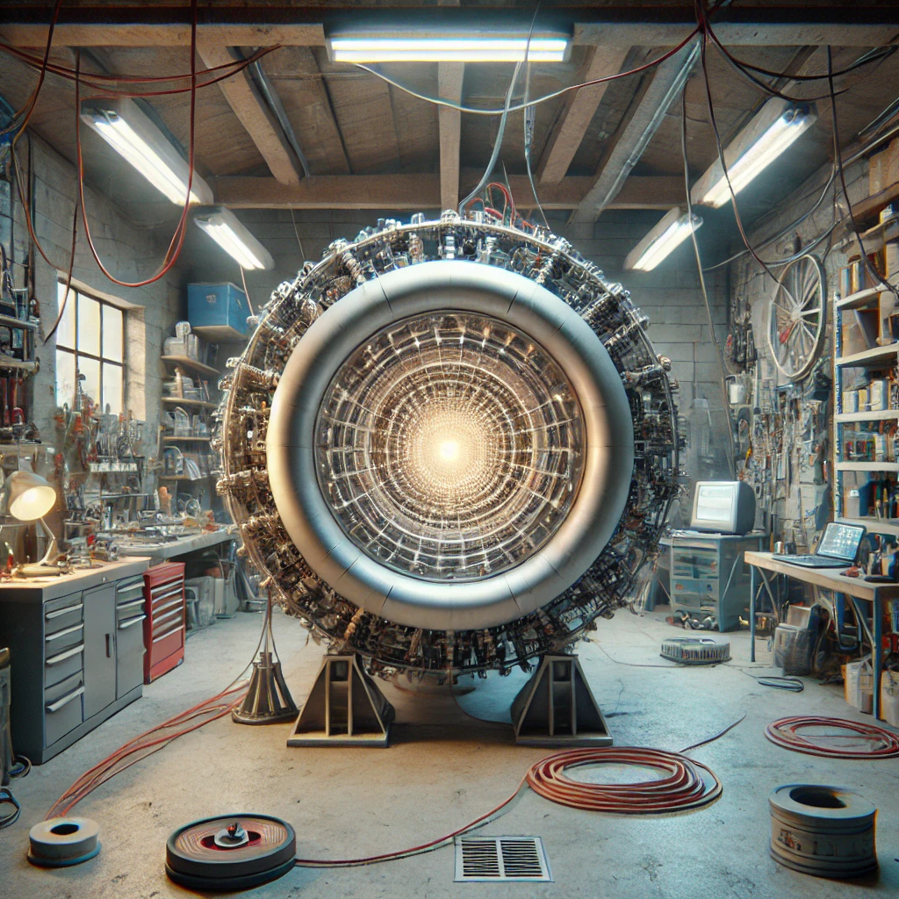

# Recap of the Experiment: Gold Creation via Particle Collider

## Objective of the Experiment:
The theoretical objective of this experiment is to attempt to create gold (Au) from mercury atoms (Hg) using a particle collider. The idea is to induce the loss of one proton in the nuclei of mercury-198 (Hg-198), thereby transforming these atoms into gold-197 (Au-197).

## Required Equipment:
### Circular Particle Collider:
- **Size**: Diameter of 10 meters (hypothetical).
- **Type**: Synchrotron with superconducting magnets to guide ions along the circular trajectory.
- **Magnetic Field Required**: Approximately 10 teslas to maintain the mercury ions on a circular trajectory.

### Source of Mercury Ions:
- **Isotope Used**: Mercury-198.
- **Ionization**: Mercury must be ionized (Hg⁺ or Hg²⁺) to be accelerated by the collider.

### Acceleration System:
- **Ion Acceleration**: To an energy on the order of giga-electronvolts (GeV) per nucleon.

### Detection Systems:
- **Detectors**: To identify and analyze the products of the collisions, particularly to verify the creation of gold.

### Cryogenic Cooling Systems:
- **Usage**: To keep the superconducting magnets at temperatures close to absolute zero.

### Energy Infrastructure:
- **Supply**: Electrical power of several hundred kilowatts to megawatts to operate the entire setup.

## Operating Instructions:
### Preparation:
- **Ionization**: Prepare packets of mercury-198 ions by ionizing them to obtain Hg⁺ or Hg²⁺ ions.
- **Injection**: Inject these ion packets into the collider.

### Acceleration:
- **Speed Increase**: Accelerate the mercury ions to relativistic speeds (close to the speed of light) using the collider's electric fields.
- **Guidance**: Use superconducting magnets to maintain the ions on the circular trajectory.

### Collision:
- **Ion Packet Collisions**: Arrange high-energy collisions between the packets of mercury ions in the collider.
- **Nuclear Reaction**: Monitor the loss of protons from these collisions, hoping to produce gold-197 atoms.

### Detection and Analysis:
- **Product Analysis**: Use detectors to identify the collision products. Specifically, look for the presence of gold-197.
- **Verification**: Confirm the creation of gold by measuring the number of protons (79 for gold) and the atomic mass (197 u).

### Evaluation:
- **Efficiency**: Assess the amount of gold produced relative to the amount of mercury used and the energy consumed.
- **Documentation**: Record the results, including the conditions of the experiment, observations, and conclusions.

## Technical Considerations and Limitations:
- **Energy Consumption**: The experiment requires an enormous amount of energy to operate the collider, power the cryogenic systems, and maintain the necessary conditions for collisions.
- **Gold Production**: The amount of gold produced is extremely small, likely on the order of a few nanograms or micrograms, making the experiment economically unviable.
- **Technical Complexity**: The technical challenges associated with handling heavy ions like mercury in a small collider are significant, including the need for extremely powerful magnetic fields and precise control of the ion beams.

## Conclusion:
While theoretically possible, this experiment exemplifies how fascinating concepts in particle physics may have limited practical and economic applications. It also highlights the incredible sophistication required to achieve nuclear transmutations, even on very small scales. The experiment serves primarily scientific and exploratory purposes rather than practical applications such as gold production.

---

## Potential Gold Production:

We will use the previously calculated production values for a frequency of 60 to 600 million packets per minute. The amount of gold produced will be very small, on the scale of nanograms (ng) and micrograms (µg).

### 1 Hour:
- **Minimum Production**: 11.94 µg of gold
- **Maximum Production**: 119.52 µg of gold

### 1 Day (24 hours):
- **Minimum Production**: 286.56 µg of gold
- **Maximum Production**: 2.868 mg of gold

### 1 Month (30 days):
- **Minimum Production**: 8.5968 mg of gold
- **Maximum Production**: 86.04 mg of gold

### 1 Year (365 days):
- **Minimum Production**: 104.2944 mg of gold (0.104 g)
- **Maximum Production**: 1.04682 g of gold

## Estimated Energy Consumption:

The energy required to operate the collider depends on several factors, but we estimated a consumption between 10 kW and 100 kW to keep the systems running.

### Consumption per Hour:
- **Minimum Consumption**: 10 kWh
- **Maximum Consumption**: 100 kWh

### Consumption per Day (24 hours):
- **Minimum Consumption**: 240 kWh
- **Maximum Consumption**: 2,400 kWh

### Consumption per Month (30 days):
- **Minimum Consumption**: 7,200 kWh
- **Maximum Consumption**: 72,000 kWh

### Consumption per Year (365 days):
- **Minimum Consumption**: 87,600 kWh
- **Maximum Consumption**: 876,000 kWh

## Summary:
- **Gold Production**: The production of gold over extended periods remains extremely low, with a theoretical maximum of 1.04682 grams of gold in one year of continuous operation at the maximum packet frequency.
- **Energy Consumption**: Even at the lowest estimate, the energy consumption is very high. For a year of operation, it could consume between 87,600 kWh and 876,000 kWh. By comparison, an average household consumes around 10,000 to 15,000 kWh per year.

## Conclusion:
This exercise clearly shows that while the transmutation of mercury into gold is scientifically interesting, it is energetically costly and very inefficient in terms of gold production. The energy consumption relative to the amount of gold produced makes this approach completely impractical for any economic application, and it primarily serves as a demonstration of the possibilities and limits of modern nuclear physics.
